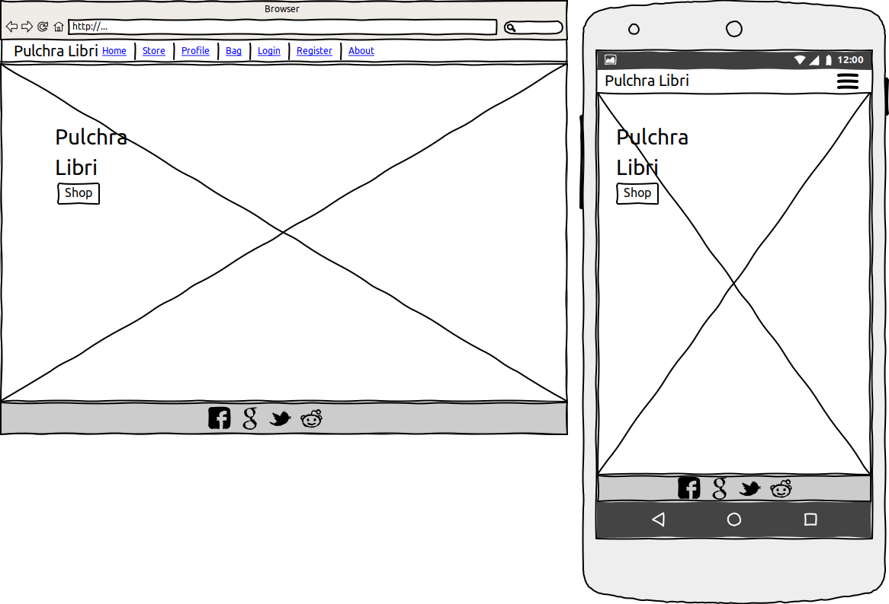
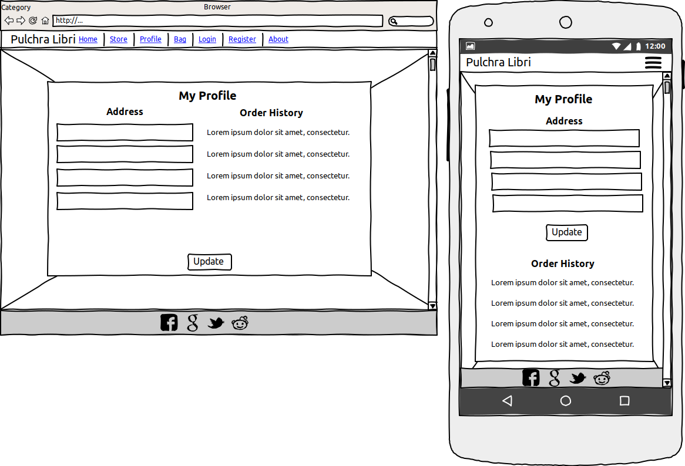
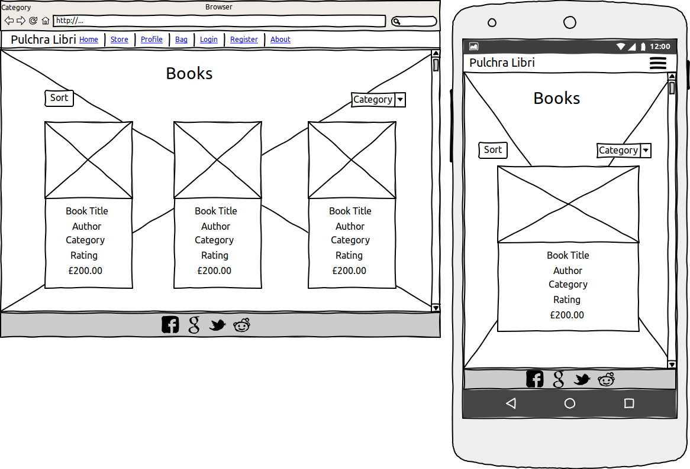
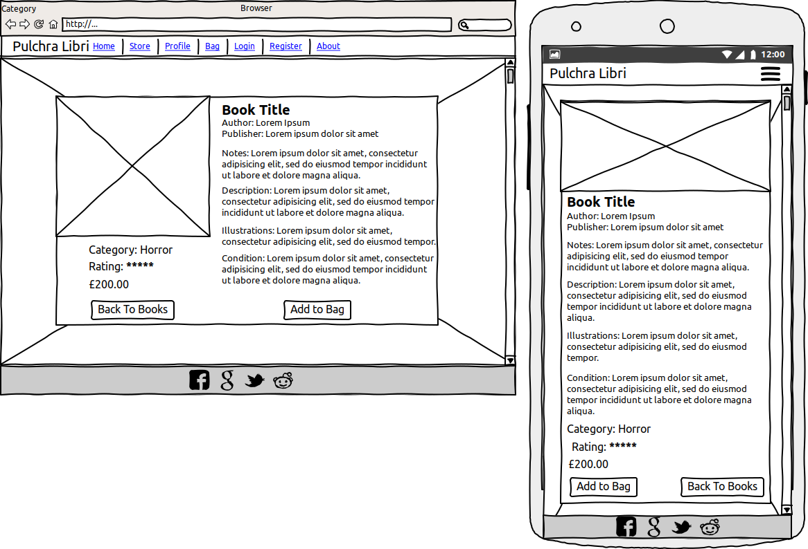
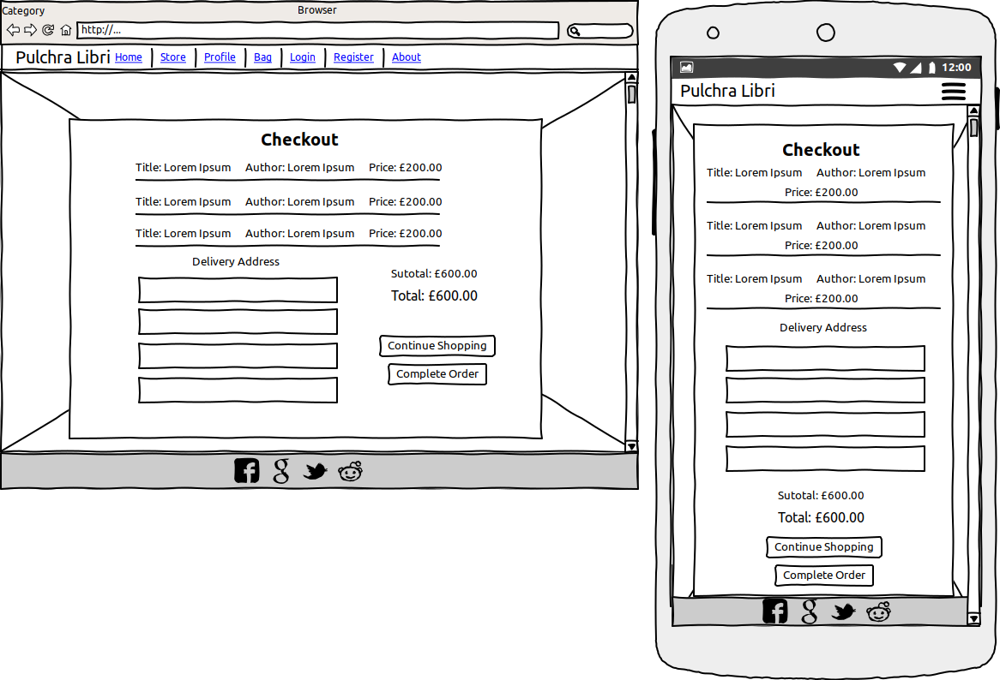
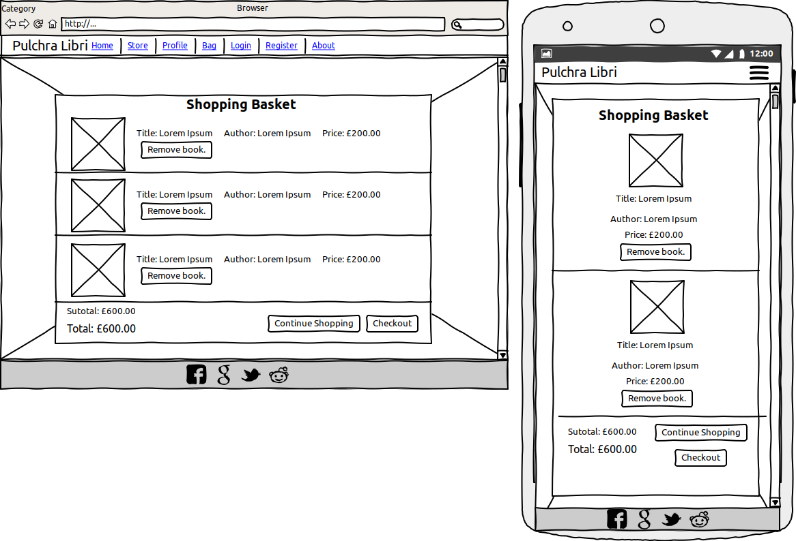
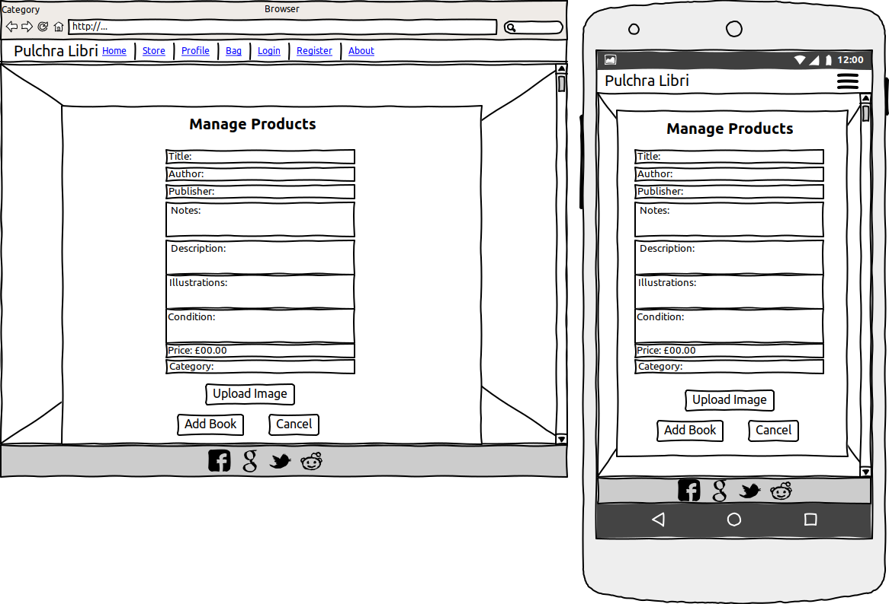

# Welcome to Pulchra Libri

Pulchra Libri is an E-commerce store whose aim is to bring beautifully crafted books to people who love to read.
Users can purchase books as a guest or register.
Registered users will be able to access their profile page to view their previous purchases.

# User Experience (UX)

## User Stories

### First Time Visitor Goals
1. Upon first visiting the site, I want to understand what the site is for
2. Easily navigate through the site
3. Quickly create a user account if I think I will use the site again for future purchases
4. Easily make purchases with or without being a registered user
5. Clearly find products for sale and find more information about these before adding to my basket
6. Search for a particular product or only view products of a particular category
7. Sort products by category, price and ratings

### Registered User Goals
1. Easily log in and out of my account
2. Reset my password if I forget it
3. Save my preferred delivery information on my profile for quicker, more convenient checkout
4. View details of my past orders
5. Receive a verification email when creating my account for extra security
6. Receive confirmation that my order has been successful after checkout
7. Be confident that the payment method used is secure
8. Sort products by category, price and ratings
9. Search for a particular product or only view products of a particular category

### Guest User Goals
1. Easily checkout without need to create an account
2. Make a purchase by inputting my delivery information at the checkout
3. Receive confirmation that my order has been successful after checkout
4. Be confident that the payment method used is secure
5. Sort products by category, price and ratings

### Admin/Owner Goals
1. Feel confident a user can easily navigate the site to make purchases
2. Easily add, edit or delete items to/from the store
4. Allow users who do not wish to create an account to also make purchases through the site
5. Make users aware and remind them that they can qualify for free shipping if they spend £255.00+ - this encourages users to spend more to take advantage of free shipping offer

## Design

## Colour Scheme

## Typography

## Imagery

[Unsplash](https://unsplash.com/)

## Wireframes

# Technologies Used

Languages used for this site:

- [JavaScript](https://www.javascript.com/)
- [HTML5](https://en.wikipedia.org/wiki/HTML5)
- [CSS3](https://en.wikipedia.org/wiki/Cascading_Style_Sheets)
- [Python](https://www.python.org/)
- [Bootstrap](https://getbootstrap.com/)
- [Flask](https://flask.palletsprojects.com/en/1.1.x/)
- [Jinja](https://jinja.palletsprojects.com/)

## Frameworks, Libraries & Programs Used

1. [Google Fonts:](https://fonts.google.com/)
   - Google fonts were used to import the Roboto font 
2. [Font Awesome:](https://fontawesome.com/)
   - Font Awesome was used for icons that appear on the site
3. [GitHub:](https://github.com/)
   - GitHub was used to store the project and version control
4. [Wire Frame Sketcher:](https://wireframesketcher.com/)
   - Balsamiq was used to create the wireframes for the site
5. [Heroku:](https://www.heroku.com/)
   - Heroku was used to deploy the site
6. [MongoDB:](https://www.mongodb.com/cloud/atlas)
   - MongoDB used to store data in collections
7. [Unsplash:](https://unsplash.com/)
   - Unsplash for the free images.
8. [Bootstarp:](https://getbootstrap.com/)
   - Frameworks for building clean responcive sites.
9. [jQuery:](https://jquery.com/)
   - jQuery is a fast, small, and feature-rich JavaScript library.

# Features

## Sitewide

### Nav Bar
* The navbar collapses at the Bootstrap medium breakpoint and below. It can be expanded by clicking the collapsed nav icon to access the nav-links.
* Main nav items have a hover effect active which makes the text slightly lighter.
* Dropdown nav items have a hover effect which makes the text slightly lighters.

### Banner
* The site banner shows to free delivery threshold.

### Footer
* The footer contains social media links and is at the bottom of each page.

## Homepage
* The home page features a call-to-action button which is labelled 'Shop Now!'. This button, when clicked, will render the products.html template. Displaying all books within Pulchra Libri's catalogue to the user.

   # Data Structure

   # Testing

## Code Validation

### HTML

---

### CSS

---

### Python

---

### JavaScript

## Testing User Stories from User Experience (UX) Section and Testing

## First Time Visitor Goals

## Returning Time Visitor Goals & Frequent Time Visitor Goals

## Further Testing

# Bugs/Known Issues

# Resolved Issues

# Lighthouse diagnostic results

# Deployment

## Github & Gitpod 

## MongoDB

## Heroku

# Credit
